<div align="center">

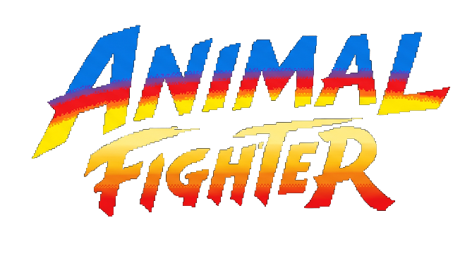

**ポーズ差分画像で遊ぶブラウザ対戦格闘ゲーム（Ver.5）**

React 18 × Vite × TypeScript × Canvas 2D

</div>

---

## 🎮 ゲーム紹介

動物たちのストリートファイト。10体のファイターから1体を選び、CPU との 99 秒 × 2 本先取のラウンド制バトルに挑みます。

- **パンチ・キック・飛び道具** の3種の攻撃。それぞれ発生・持続・硬直のフレームデータを持ちます
- **ガード**は相手と逆方向に入力（ダメージ 1/4 に軽減）
- CPU は距離に応じて性格が変わる確率ドリブン AI（遠いと接近、近いと打撃、飛び道具は見てから回避）

## 🐾 ファイター

<table>
  <tr>
    <td align="center">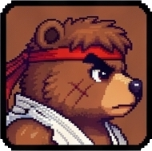<br/><b>KUMA-RYU</b></td>
    <td align="center">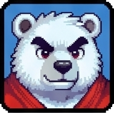<br/><b>KUMA-KEN</b></td>
    <td align="center">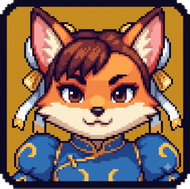<br/><b>KITSUNE CHUN-LI</b></td>
    <td align="center">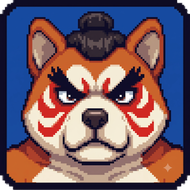<br/><b>AKITA-DOG HONDA</b></td>
    <td align="center">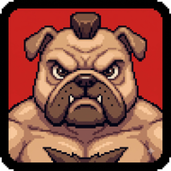<br/><b>BURU-DOG ZANGIEF</b></td>
  </tr>
  <tr>
    <td align="center">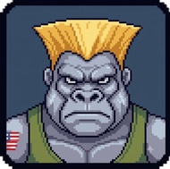<br/><b>GORILLA GUILE</b></td>
    <td align="center">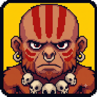<br/><b>GIBBON DHALSIM</b></td>
    <td align="center">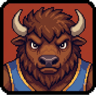<br/><b>BISON BUFFALO</b></td>
    <td align="center">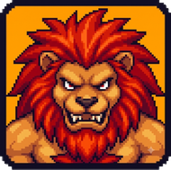<br/><b>SHISHI BLANKA</b></td>
    <td align="center">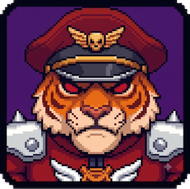<br/><b>TIGER VEGA</b></td>
  </tr>
</table>

※ 現時点で能力値は全キャラ共通（見た目のみの差分）。キャラ差は今後のロードマップ参照。

## 🕹️ 操作方法

ゲーム画面をクリックしてフォーカスしてから操作します。

| キー | バトル中 | メニュー |
| --- | --- | --- |
| ← → | 移動（相手と逆方向でガード） | カーソル移動 |
| ↑ | ジャンプ | カーソル移動（上の行へ） |
| ↓ | しゃがみ | カーソル移動（下の行へ） |
| Z | パンチ | — |
| X | キック | — |
| C | 飛び道具 | — |
| Enter | — | 決定 |
| Esc | — | 前の画面に戻る |

画面フロー: **タイトル → キャラ選択 → CPU キャラ選択（ミラーマッチ禁止）→ ステージ選択 → 対戦 → リザルト**。Esc で逆順に戻れます。

## 🚀 セットアップ

```bash
pnpm install
pnpm dev        # 開発サーバー起動
pnpm test       # ゲームロジックのユニットテスト（vitest）
pnpm build      # 型チェック + プロダクションビルド
pnpm preview    # ビルド結果の確認
```

## 📁 プロジェクト構成

```
animal-fighter/
├── index.html                        エントリ HTML（#root のみ）
├── vite.config.ts                    Vite + vitest 設定（@ → ./src エイリアス）
├── package.json
├── pnpm-lock.yaml                    依存バージョンの固定（常にコミットする）
└── src/
    ├── main.tsx                      React エントリポイント
    ├── App.tsx                       AnimalFighter を中央配置するだけの薄いラッパー
    ├── index.css                     Tailwind ディレクティブ
    ├── assets/animal-fighter/
    │   ├── title-logo.png            タイトルロゴ
    │   ├── backgrounds/              ステージ背景 5 種
    │   └── <キャラ名>/               キャラごとのポーズ差分画像
    │                                 （icon / fight / punch / kick / jump / crouch / guard / down）
    └── components/modules/AnimalFighter/
        ├── index.ts                  再エクスポート
        ├── AnimalFighter.tsx         ゲーム画面の React コンポーネント（canvas + 操作説明 UI）
        ├── useAnimalFighter.ts       Canvas 描画・キー入力・rAF ループ（DOM に触るのはここだけ）
        ├── assets.ts                 画像のビルド時 import と URL 解決
        ├── logic.ts                  ⭐ ゲームロジック本体（DOM 非依存の純関数）
        └── logic.test.ts             ロジックのユニットテスト（vitest）
```

### アーキテクチャの要点

ロジックと描画が完全に分離されています。`logic.ts` の `advanceGame(state, input, options)` が「現在の状態 + 1フレーム分の入力 → 次の状態」を返す純関数で、`useAnimalFighter.ts` が requestAnimationFrame で毎フレームこれを呼んで canvas に描画します。乱数も外から注入するため、CPU の挙動含めてすべてユニットテストで再現できます。

### logic.ts の中身ガイド

ファイル内はセクションコメント（`// ---- セクション名 ----`）で区切られています。上から順に:

| セクション | 内容 |
| --- | --- |
| 基本定数 | 画面サイズ・ラウンド時間などのゲーム全体の定数 |
| キャラクター定義 | `CHARACTER_DEFINITIONS`（10体の id・名前・カラー） |
| 攻撃のフレームデータ | `ATTACKS`（発生/持続/硬直/ダメージ/リーチ） |
| CPU の行動抽選テーブル | `CPU_PROBABILITIES`（距離帯別の重み。難易度調整はここ） |
| 型定義 | ファイター・画面・入力・ゲーム状態の型 |
| 状態の生成と複製 | 初期状態・フレームごとのクローン |
| 選択画面のカーソル操作 | ミラーマッチ回避を含むカーソル移動 |
| 当たり判定と幾何ヘルパー | やられ判定・矩形交差・ガード判定 |
| 攻撃システム | 攻撃の開始条件・攻撃判定の矩形・ヒット/ガード処理 |
| 飛び道具とヒット解決 | 弾の生成・打撃のヒット判定 |
| CPU 思考ルーチン | 約0.5秒ごとの行動抽選と実行 |
| ファイターの毎フレーム更新 | プレイヤー入力の反映 / CPU 行動の実行・物理 |
| フィールド上のオブジェクト更新 | 押し戻し・弾・エフェクト・攻撃モーション進行 |
| ラウンド終了と勝敗 | KO / タイムアップ判定、2本先取 |
| 対戦中の1フレーム更新パイプライン | `updateFight`（処理順が仕様） |
| エントリポイント | `advanceGame`（画面遷移と入力の振り分け） |
| スプライト選択 | 状態 → 表示ポーズ・描画サイズの決定 |

## 🗺️ ロードマップ

- [x] 選択画面の上下キー移動・Esc で前の画面に戻る
- [ ] **キャラごとの必殺技**（コマンド入力で発動）
  - `chunli/spinning-bird-kick/`（アニメ4フレーム）がアセットのみ先行導入済み・コード未参照
- [ ] **技のキャラ別フレームデータ**: 現在 `ATTACKS` は全キャラ共通。キャラごとに発生・持続・硬直・ダメージ・リーチを差別化する
  - 実装方針: `CHARACTER_DEFINITIONS` にステータス/技テーブルを持たせ、`startAttack` / `resolveAttacks` が参照する形へ拡張
- [ ] 技ごとのポイント（威力・削り・気絶値など）の区別

## 📜 出典

[x-point-1/x-point-1-supervisor](https://github.com/x-point-1/x-point-1-supervisor) PR #1319（ANIMAL FIGHTER Ver.5）からゲーム部分を単体アプリとして切り出したものです。
